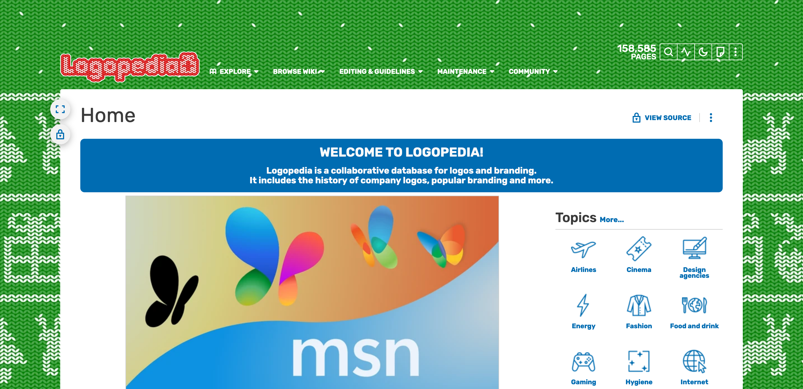

# Fandomless
Remove the Fandom header and sidebar from any Fandom wiki.

# Installation
1. Install [Stylebot](https://github.com/ankit/stylebot)
2. Go to the options menu, then styles
3. Add a style for `*.fandom.com`
4. Paste the following: `@import url(https://raw.githubusercontent.com/Nodysey/fandomless/refs/heads/main/fandomless.css)`